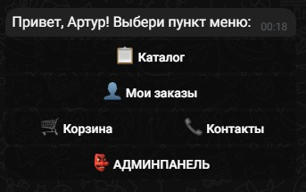
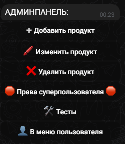
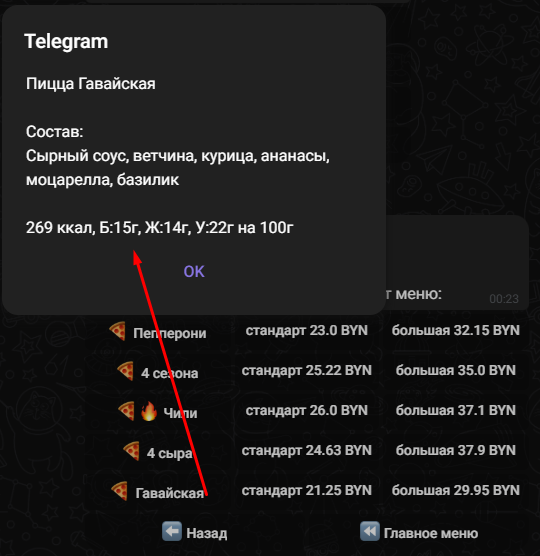
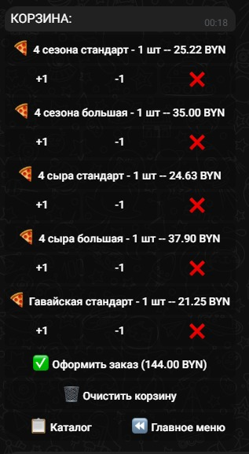
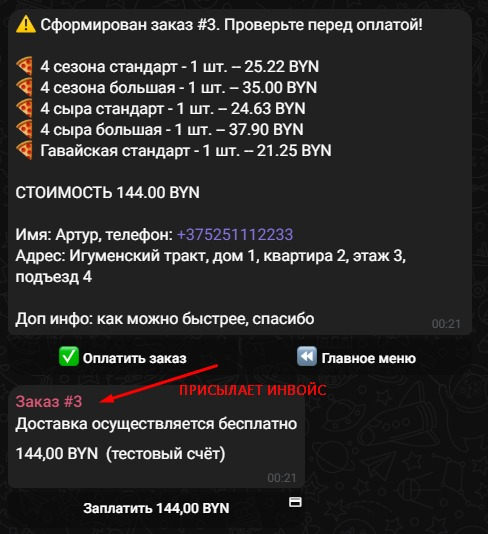
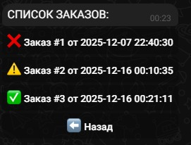

# 🤖 Aiogram Bot
Проект Telegram бота на Aiogram 3.21+ клиентов и администраторов пиццерий

## 🚀 Быстрый старт

### Через Docker

1. **Клонируйте репозиторий:**
```bash
git clone https://github.com/Deulix/Aiogram-Bot.git
```

2. **Перейдите в папку проекта:**
```bash
cd '.\Aiogram Bot\'
```

3. **Переименуйте env файл и настройте его (смотрите ниже):**
```bash
cp .env.example .env
```

4. **Запустите через Docker Compose:**
```bash
docker-compose up -d
```


## ⚙️ Конфигурация
Перед запуском заполните .env файл:
```python
BOT_TOKEN=your_bot_token # ваш токен от @botfather в telegram
ADMIN_ID=your_telegram_id # ваш id в telegram
REDIS_PORT=your_redis_port # стандартный порт redis (по умолчанию 6379)
REDIS_HOST=your_redis_host # стандартный хост redis (по умолчанию "redis")
DATABASE_URL="sqlite+aiosqlite:///src/app/database/shop.db" # ваш путь к базе данных, указан по умолчанию
TEST_PAYMENT_KEY=your_redis_port # ваш токен (ключ) для оплаты 
MAPS_API_KEY=your_redis_port # ваш токен (ключ) от Yandex JavaScript API и HTTP Геокодер
```
## 📁 Структура проекта
```bash
Aiogram-Bot/
├── alembic/
│   ├── versions/
│   │   ├── ...
│   ├── env.py
│   ├── README
│   └── script.py.mako
├── logs/
│   └── bot_history.log
├── src/
│   ├── app/
│   │   ├── api/
│   │   │   ├── routers/
│   │   │   ├── services/
│   │   │   │   └── user_service.py
│   │   │   ├── templates/
│   │   │   │   └── index.html
│   │   │   └── main.py # Вход в API
│   │   ├── bot/
│   │   │   ├── core/
│   │   │   │   ├── __init__.py
│   │   │   │   └── callbacks.py
│   │   │   ├── handlers/
│   │   │   │   ├── __init__.py
│   │   │   │   ├── admin_handlers.py
│   │   │   │   ├── cart_handlers.py
│   │   │   │   ├── handlers_routers.py
│   │   │   │   ├── navigation_handlers.py
│   │   │   │   ├── order_handlers.py
│   │   │   │   └── payment_handlers.py
│   │   │   ├── keyboards/
│   │   │   │   ├── __init__.py
│   │   │   │   ├── admin_keyboards.py
│   │   │   │   ├── navigation_keyboards.py
│   │   │   │   ├── order_keyboards.py
│   │   │   │   └── testing_keyboards.py
│   │   │   ├── services/
│   │   │   │   └── cart_service.py
│   │   │   ├── utils/
│   │   │   │   └── validators.py
│   │   │   └── main.py # Вход в бота
│   │   ├── config/
│   │   │   ├── logger.py
│   │   │   └── settings.py
│   │   └── database/
│   │       ├── models.py
│   │       ├── redis_db.py
│   │       ├── shop.db
│   │       ├── sqlite_db_dump.sql
│   │       └── sqlite_db.py
│   └── tests/
├── .dockerignore
├── .env.example
├── .gitignore
├── .python-version
├── alembic.ini
├── docker-compose.yml
├── Dockerfile
├── pyproject.toml
├── pytest.ini
├── README.md
└── uv.lock
```

## 🛠️ Технологии
 - основной язык

 - современный фреймворк для Telegram ботов

 - работа с базой данных

 - для хранения корзины клиента

 - контейнеризация приложения

 - миграции баз данных

## 📈 Особенности
- Готовая структура для масштабирования

- Поддержка Docker из коробки

- Инлайн-клавиатуры и меню

- Возможность в будущем кэшировать через Redis

- Асинхронная архитектура

- Легкая кастомизация

## 📷 Примеры работы бота

- Главное меню (вид для администратора)

- Админпанель

- Каталог (в данном случае пицц)

- Информация о товаре при нажатии

- Корзина с показом стоимости

- Оформление заказа

- Список заказов пользователя с отображением состояния


## DONE
- [x] CRUD для заказов, продуктов
- [x] Корзина Redis
- [x] Админка через Telegram
- [x] Оплата (тестовая)

## ONGOING

- [ ] Админка через FastAPI <--
- [ ] Тесты

## TODO

- [ ] PostgreSQL

